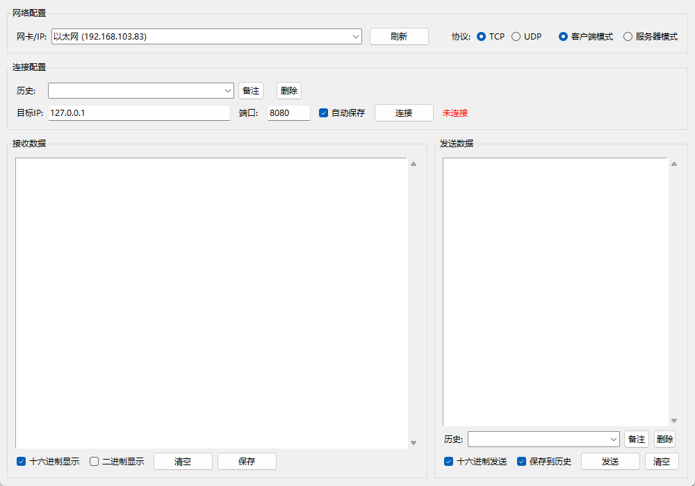

# TCP/UDP 调试工具

[](https://www.python.org/downloads/)
[](LICENSE)

一款功能强大的 TCP/UDP 网络调试工具，支持桌面版（GUI）和 Web 版两种使用方式，适用于网络协议开发、嵌入式调试、物联网设备通信等场景。

## ✨ 主要功能

### 协议支持
- **TCP 协议** - 支持客户端模式和服务器模式
- **UDP 协议** - 支持客户端模式和服务器模式，支持广播

### 双版本提供
- **桌面版** - 基于 Tkinter 的图形界面，无需浏览器
- **Web 版** - 基于 Flask + SocketIO，通过浏览器访问

### 核心特性
- 🌐 **多网卡支持** - 自动识别并选择本机网卡/IP
- 📊 **多种数据显示格式** - 文本、十六进制、二进制
- 💾 **历史记录管理** - 支持连接历史和发送历史，可添加备注
- 🔢 **灵活的十六进制输入** - 支持标准格式、带 h/H 后缀、0x 前缀等多种格式
- 📝 **数据保存** - 支持保存接收到的数据到文件
- 🎯 **客户端管理**（服务器模式）- 显示已连接客户端列表，可选择特定客户端发送

## 📦 安装与使用

### 方式一：使用预编译的可执行文件（推荐）

1. 从 [Releases](https://github.com/yourusername/tcp-udp-tool/releases) 页面下载最新版本
2. 解压后运行：
   - `TCP_UDP_Tool.exe` - 桌面版
   - `TCP_UDP_Tool_Web.exe` - Web版（运行后访问 http://localhost:5000）

### 方式二：从源码运行

#### 环境要求
- Python 3.8+
- pip

#### 安装步骤

```bash
# 克隆仓库
git clone https://github.com/yourusername/tcp-udp-tool.git
cd tcp-udp-tool

# 创建虚拟环境（可选但推荐）
python -m venv .venv
source .venv/bin/activate  # Linux/Mac
# 或 .venv\Scripts\activate  # Windows

# 安装依赖
pip install -r requirements.txt

# 运行桌面版
python main.py

# 或运行 Web 版
python web_server.py
# 然后访问 http://localhost:5000
```

#### 打包成可执行文件

```bash
# 安装 PyInstaller
pip install pyinstaller

# 打包桌面版
pyinstaller --onefile --windowed --name "TCP_UDP_Tool" main.py

# 打包 Web 版
pyinstaller --onefile --console --name "TCP_UDP_Tool_Web" --add-data "templates;templates" web_server.py
```

打包后的文件位于 `dist/` 目录。

## 🖥️ 使用说明

### 桌面版界面



界面说明：
- **网络配置** - 选择网卡/IP、协议类型（TCP/UDP）、工作模式（客户端/服务器）
- **连接配置** - 管理连接历史、设置目标IP和端口、自动保存选项
- **接收数据** - 显示接收到的数据，支持十六进制/二进制显示切换
- **发送数据** - 输入要发送的数据，支持十六进制发送、历史记录管理

### 快速开始

#### 1. TCP 客户端模式
1. 选择网卡/IP
2. 选择协议为 **TCP**，模式为 **客户端**
3. 输入目标 IP 和端口
4. 点击 **连接**
5. 在发送区输入数据，点击 **发送**

#### 2. TCP 服务器模式
1. 选择网卡/IP
2. 选择协议为 **TCP**，模式为 **服务器**
3. 输入监听端口
4. 点击 **启动服务器**
5. 等待客户端连接
6. 选择客户端，发送数据

#### 3. UDP 模式
- 与 TCP 类似，但 UDP 是无连接协议
- 支持广播发送（发送时目标 IP 设为 `255.255.255.255`）

### 历史记录功能

#### 连接历史
- 自动保存连接过的地址（可勾选"自动保存"）
- 支持从历史列表快速选择并自动连接
- 可为每个连接添加备注（如"测试服务器"、"生产设备"）
- 支持删除单条历史记录

#### 发送历史
- 勾选"保存到历史"后，发送的数据会自动保存
- 支持从历史列表快速选择之前发送过的数据
- 可为每条数据添加备注
- 支持删除单条历史记录

### 数据显示格式

#### 文本格式（默认）
直接显示 UTF-8 文本内容。

#### 十六进制格式
勾选"十六进制显示"后：
```
[14:30:25.123]
0000  48 65 6C 6C 6F 20 57 6F 72 6C 64                 Hello World
```

#### 二进制格式
勾选"二进制显示"后：
```
[14:30:25.123] [二进制]
0000  01001000 01100101 01101100 01101100  |  48 65 6C 6C
0008  01101111 00100000 01010111 01101111  |  6F 20 57 6F
0010  01110010 01101100 01100100           |  72 6C 64
```

更多显示格式说明详见 [docs/hex_display_format.md](docs/hex_display_format.md)。

### 十六进制输入格式

工具支持多种十六进制输入格式：

| 格式 | 示例 | 说明 |
|------|------|------|
| 标准格式 | `48 65 6C 6C 6F` | 空格分隔 |
| 带 h/H 后缀 | `48h 65H 6Ch` | 支持大小写 |
| 0x 前缀 | `0x48 0x65 0x6C` | 支持大小写 |
| 连续格式 | `48656C6C6F` | 无分隔符 |

更多输入格式说明详见 [HEX_FORMAT.md](HEX_FORMAT.md)。

## 📁 项目结构

```
tcp-udp-tool/
├── main.py                 # 桌面版入口
├── web_server.py           # Web 版入口
├── gui.py                  # 桌面版 GUI 实现
├── network.py              # 网络通信模块
├── utils.py                # 工具函数
├── templates/              # Web 版 HTML 模板
│   └── index.html
├── docs/                   # 文档
│   ├── images/             # 图片资源
│   │   └── gui-screenshot.png
│   └── hex_display_format.md
├── HEX_FORMAT.md           # 十六进制格式说明
├── requirements.txt        # Python 依赖
├── README.md               # 本文件
└── LICENSE                 # 许可证
```

## 🔧 技术栈

- **Python 3.8+** - 核心编程语言
- **Tkinter** - 桌面版 GUI 框架
- **Flask** - Web 版后端框架
- **Flask-SocketIO** - Web 版实时通信
- **PyInstaller** - 打包工具

## 📝 配置说明

配置文件 `config.json` 会自动生成在程序运行目录，包含：
- `connection_history` - TCP 连接历史
- `udp_connection_history` - UDP 连接历史
- `send_history` - 发送数据历史

## 🤝 贡献指南

欢迎提交 Issue 和 Pull Request！

1. Fork 本仓库
2. 创建你的特性分支 (`git checkout -b feature/AmazingFeature`)
3. 提交更改 (`git commit -m 'Add some AmazingFeature'`)
4. 推送到分支 (`git push origin feature/AmazingFeature`)
5. 打开一个 Pull Request

## 📄 许可证

本项目采用 [MIT](LICENSE) 许可证开源。

## 🙏 致谢

- 感谢所有贡献者的支持
- 感谢开源社区提供的优秀工具和库

⭐ 如果这个项目对你有帮助，请给它一个 Star！
